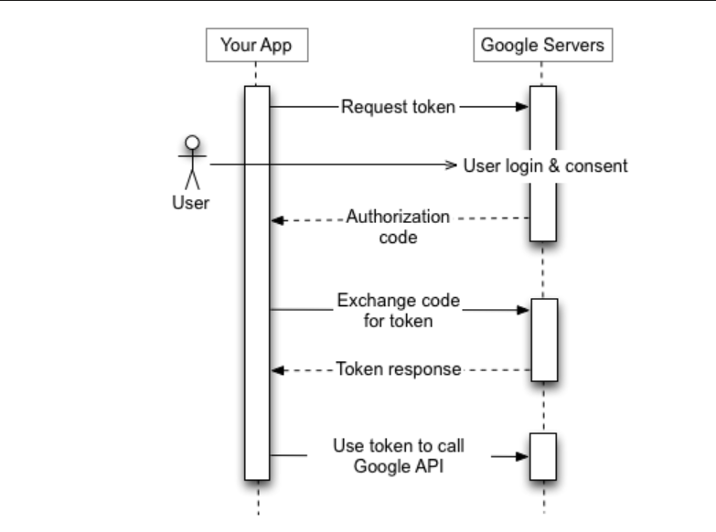

# LedgerLite

## Overview

**LedgerLite** is a simple yet powerful ledger application that allows users to manage their financial records seamlessly. Built with a session-based authentication system using Google OAuth 2.0, this application enables users to perform CRUD operations on their ledger entries while ensuring security and efficiency.

## Features

- **User Authentication**: Secure login and session management using Google OAuth 2.0.
- **CRUD Operations**: Create, Read, Update, and Delete ledger entries.
- **Responsive Design**: Built with Tailwind CSS for a modern, responsive user interface.
- **Real-time Data Handling**: Efficient data management with MongoDB Atlas.

## Technologies Used

- **Node.js**: JavaScript runtime for building scalable server-side applications.
- **Express.js**: Web framework for Node.js, providing a robust set of features for web and mobile applications.
- **MongoDB Atlas**: Cloud-based NoSQL database for flexible data storage.
- **EJS (Embedded JavaScript)**: Templating engine for rendering dynamic HTML pages.
- **Google OAuth 2.0**: Authentication protocol for secure user login.

## Packages Used

The following packages are essential for the functionality of the LedgerLite application:

- **express**: Fast, unopinionated, minimalist web framework for Node.js.
- **mongoose**: MongoDB object modeling for Node.js, enabling schema-based data modeling.
- **dotenv**: Module to load environment variables from a `.env` file into `process.env`.
- **passport**: Authentication middleware for Node.js, used with various strategies.
- **passport-google-oauth20**: Google OAuth 2.0 authentication strategy for Passport.
- **express-session**: Middleware for managing sessions in Express applications.
- **ejs**: Templating engine to render dynamic HTML pages.
- **tailwindcss**: Utility-first CSS framework for creating responsive designs.

## Setup and Installation

1. **Clone the repository**:
    ```bash
    git clone https://github.com/your-username/LedgerLite.git
    ```

2. **Navigate to the project directory**:
    ```bash
    cd LedgerLite
    ```

3. **Install dependencies**:
    ```bash
    npm install
    ```

4. **Create a `.env` file** in the root directory and add your MongoDB Atlas connection string and Google OAuth credentials:
    ```
    MONGODB_URI=your_mongodb_uri
    GOOGLE_CLIENT_ID=your_google_client_id
    GOOGLE_CLIENT_SECRET=your_google_client_secret
    SESSION_SECRET=your_session_secret
    ```

5. **Run the application**:
    ```bash
    npm start
    ```

6. **Access the application**: Open your web browser and go to `http://localhost:3000`.

## Usage

1. **Authenticate using Google**: Click on the "Login with Google" button to authenticate your session.
2. **Manage Ledger Entries**: Use the provided interface to create, view, edit, or delete your ledger entries.


# OAuth-Based Authentication

## Overview
OAuth 2.0 is a widely used authentication protocol that allows users to log in to applications securely using third-party providers like Google. This section explains how OAuth authentication works in a Node.js application using Passport.js.

---

## Session-Based Authentication

Session-based authentication works by creating a session for a user when they log in. A session ID is stored in the server's RAM and a corresponding cookie is sent to the user’s browser. This cookie is included in each subsequent request, allowing the server to validate the user's identity.

### How It Works
1. When a user logs in, a session is created on the server, and a session ID is stored in the browser’s cookies.
2. On each request, the browser sends the session ID to the server.
3. The server looks up the session data stored in memory or a session store (e.g., MongoDB with `connect-mongo`).
4. If the session is valid, the user is considered authenticated.

### Drawbacks of Session-Based Authentication
- **Scalability Issues:** Since sessions are stored in memory, handling a large number of users requires a distributed session store.
- **Session Expiry & Management:** If the server restarts, all sessions are lost unless stored in a persistent store.
- **Cross-Origin Limitations:** Session-based authentication relies on cookies, which may not work well in cross-domain applications or mobile apps.

---

## Token-Based Authentication (OAuth 2.0)

Token-based authentication solves many of the limitations of session-based authentication by using access tokens instead of server-stored sessions.

### How It Works
1. A user initiates authentication by logging in with a third-party provider (e.g., Google).
2. If authenticated, Google provides an authorization code, which the application exchanges for an access token.
3. The access token is stored on the client-side (usually in local storage or an HTTP-only cookie).
4. On each request, the client sends the access token in the authorization header.
5. The server validates the token and processes the request without storing any session data.

### Benefits of Token-Based Authentication
- **Stateless:** No need to store user sessions on the server, making it highly scalable.
- **Cross-Origin Compatibility:** Works well with mobile apps and SPAs since tokens are not restricted by cookies.
- **Security:** Tokens can be set to expire and refreshed using refresh tokens.

### Drawbacks of Token-Based Authentication
- **Token Theft:** If an access token is stolen, an attacker can use it until it expires.
- **Storage Complexity:** Securely storing tokens on the client-side requires best practices like HTTP-only cookies or secure storage mechanisms.

---

## When to Use Session-Based vs. Token-Based Authentication

| Feature | Session-Based Authentication | Token-Based Authentication |
|---------|---------------------------|---------------------------|
| Best Suited For | Traditional web applications with server-side rendering | APIs, SPAs, and mobile applications |
| Scalability | Limited (session storage required) | Highly scalable (stateless) |
| Security Concerns | Sessions can be hijacked | Tokens can be stolen if not secured properly |
| Storage | Stored in server memory or database | Stored on the client-side |
| Cross-Origin Support | Limited (cookie-based) | Works across domains |

---

## OAuth 2.0 Flow with Google

### 1. User Authentication Request
- The authentication process starts when a user clicks the "Sign in with Google" button.
- The application redirects the user to Google’s authentication page.

### 2. Google Issues Authorization Code
- After user consent, Google provides an authorization code to the application.

### 3. Exchange Authorization Code for Access Token
- The application exchanges the authorization code for an access token.

### 4. Retrieve User Profile
- Using the access token, the application fetches the user's profile information from Google.

### 5. Store and Use Access Token
- The access token is stored securely and used to authenticate API requests without maintaining a session.

---

## Google OAuth Backend Interaction



---

## Summary
Session-based authentication is suitable for traditional web applications but has scalability and session management limitations. Token-based authentication using OAuth 2.0 is better for modern web applications, APIs, and mobile apps due to its stateless nature and cross-origin support.

Using OAuth 2.0 with Passport.js enables seamless user login via third-party providers like Google while ensuring security through token-based authentication mechanisms.

## Reference

[OAuth 2.0 Concepts ](https://www.passportjs.org/concepts/oauth2/)

[Passport-Google-OAuth](https://www.passportjs.org/packages/passport-google-oauth/)


 
